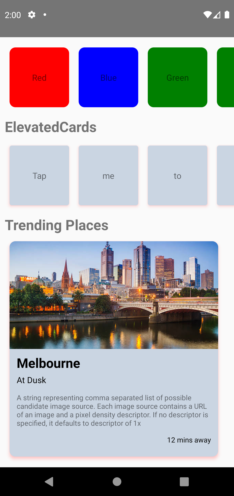

## React Native basic learner guide

1. Create a React Native project with the following command `npx react-native init <ProjectName>`
2. To run the app in either android or ios execute the command `npx react-native start`. This will run the metro and you can select `a` to run it on android.

### Key notes or findings

1. In maps, if you mention `{}` then you have give a `return` statement inside but if you are using `()` then `return` inside is not needed.
   eg:- `contacts.map((item)=>{return ();})` vs
   `contacts.map((item)=>())`
2. you can destructure an object when calling inside a map.
   eg:- `contacts.map(({uid, name, status}) => ())`

## Styler02 screenshots

 
